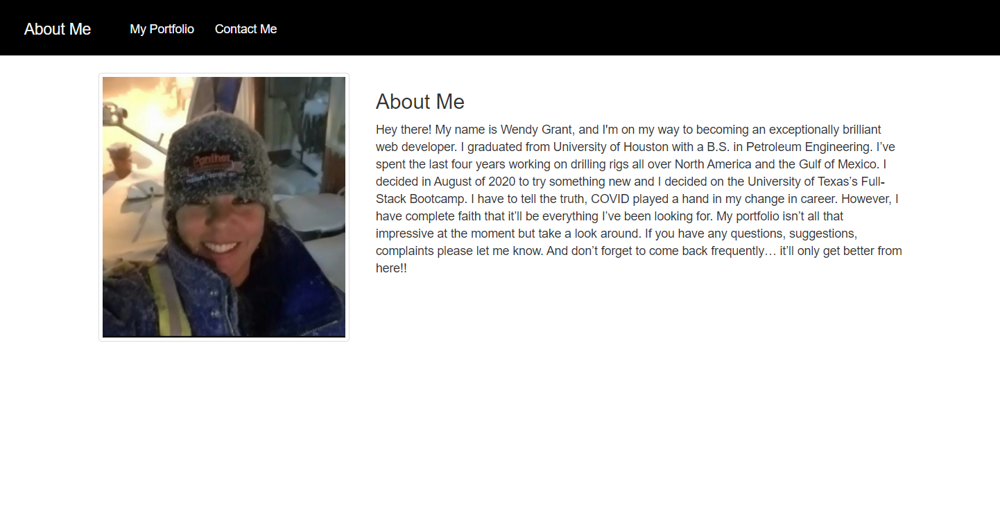

## PORTFOLIO:

## DESCRIPTION:

My portfolio showcases the projects I have completed. The assignment requires a navbar on each page, a responsive layout, functional links, semantic html, valid and correct html, personal information, utilization of Bootstrap components and grid system, responsive images, minimal use of media queries, functional applications, and GitHub repo with README.

#### DEVELOPMENTS/COMMITS:

* Added imgs to 
* Added about me section
* Added portfolio screenshots
* Added link to resume PDF
* Updated GitHub profile
* Pinned repos
* Following people
* Verified functionality
* Updated README
* Pushed final repo to GitHub

#### ISSUES/IMPROVEMENTS:

* Need borders around the images
* Need to change the navbar toggle icon
* Need border on the bottomw of the navbar

SCREENSHOTS:

### Live URL link:

#### Resume PDF URL:

https://github.com/wkgrant78/wkgrant78.github.io/blob/main/resume/Wendy%20K%20Grant.pdf

#### Deployed URL:

https://wkgrant78.github.io/   

#### GitHub repo URL:

https://github.com/wkgrant78/wkgrant78.github.io

